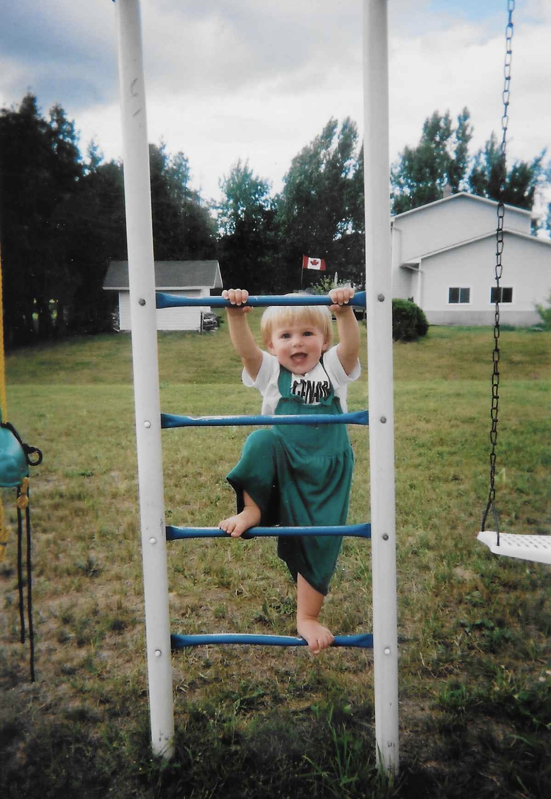
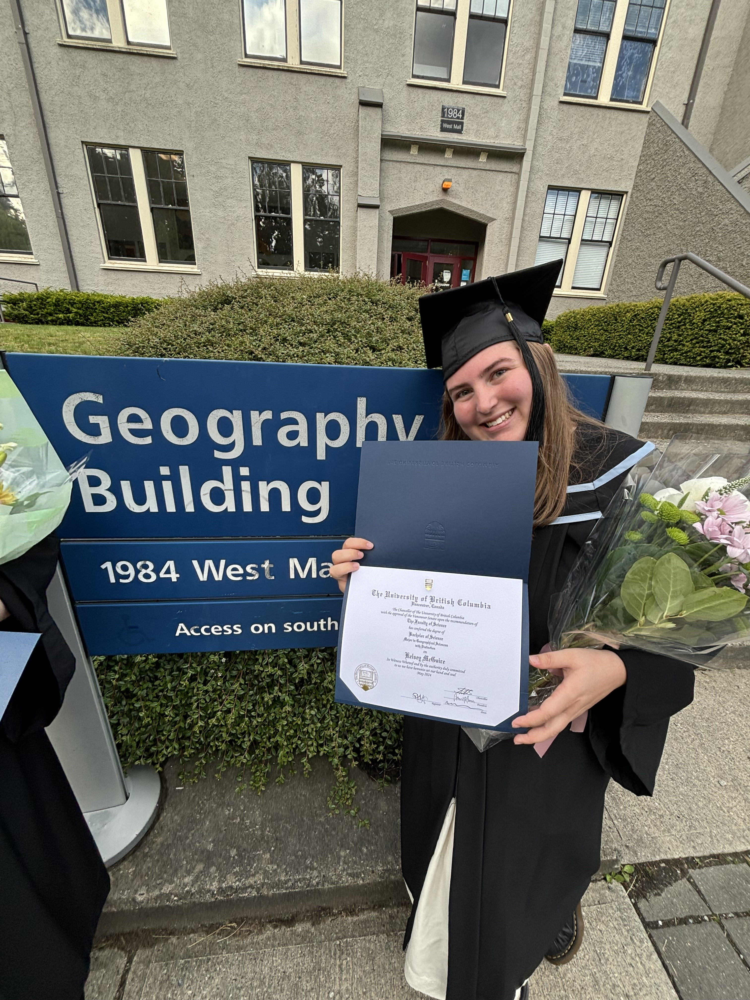
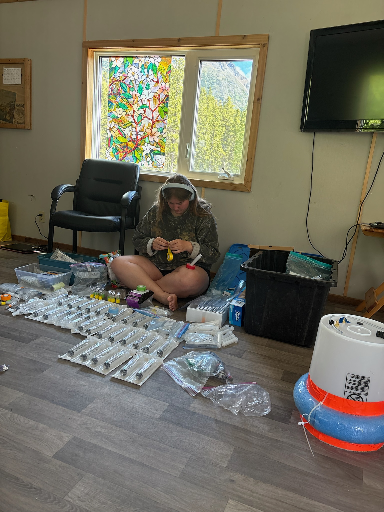
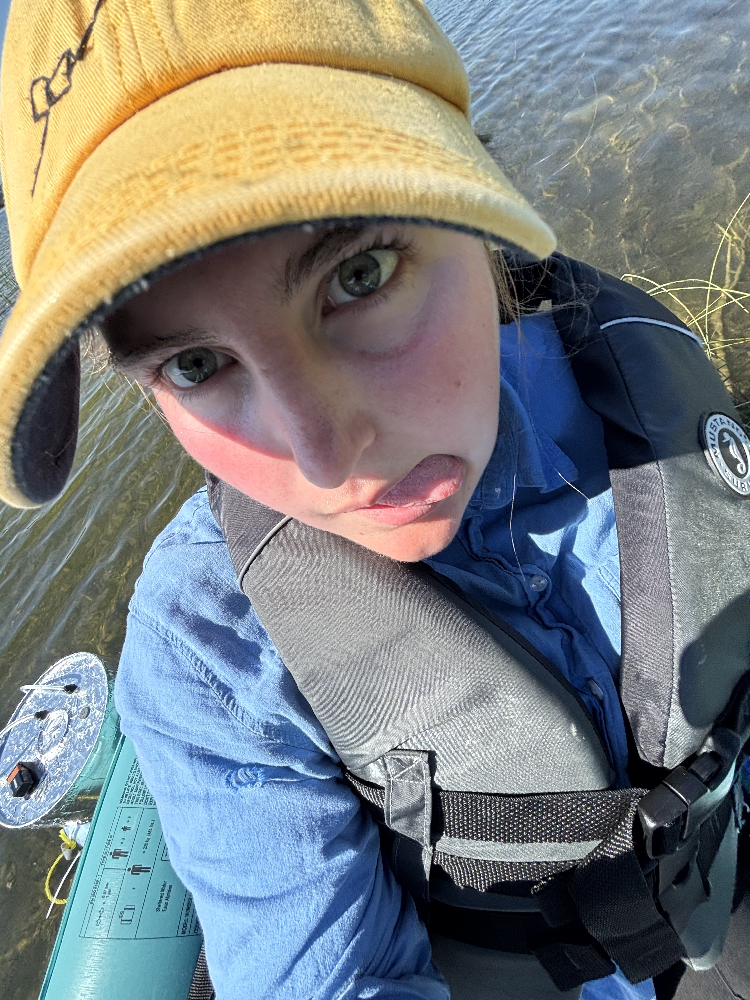
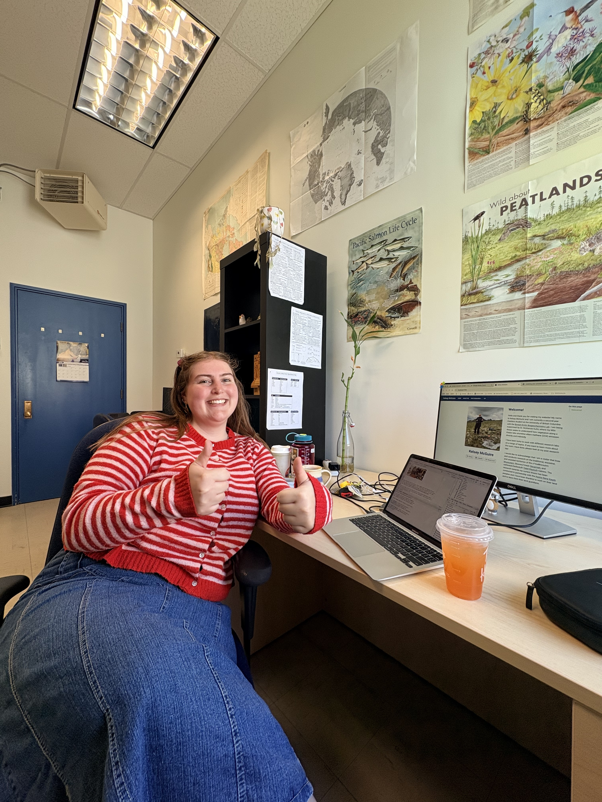

::::: {.columns .align-items-center style="gap: 2.5rem;"}
::: {.column width="30%"}
{width="85%"}
:::

::: {.column width="70%"}
 

I am originally from outside of Ottawa, ON, which is the traditional and unceded territories of the Omàmìwininìwag (Algonquin) and Anishinabewaki ᐊᓂᔑᓈᐯᐗᑭ.

I was lucky to have grown up alongside a creek where I was able to see how riparian zones and aquatic systems worked, and spent a lot of time rowing out to the small island where geese would come each spring to raise their little ones and watch the beavers at work stopping pesky running water.
:::
:::::

:::::: {.columns .align-items-center style="gap: 2.5rem;"}
::: {.column width="60%"}
Blast forward 10 or so years, and I began my undergraduate degree at Queen's University before jumping over across the country to attend the University of British Columbia for the remainder of my studies.

I pursued Geographical Sciences within the Geography Department - which I highly recommend! - and got introduced to the wonderful and challenging world of research. I started out as an Undergraduate Research Assistant within the UBC Micrometeorology lab - now the [EcoFlux lab](https://ecoflux-lab.github.io/) at McGill - under Dr. Sara Knox studying post-fire peatland bog systems, before shifting to studying tropical savanna-forest landscape dynamics with Dr. Naomi Schwartz in the [Geospatial Ecology Lab](https://naomibschwartz.github.io/).
:::

:::: {.column width="40%"}
::: {style="text-align: center;"}
{width="85%"}
:::
::::
::::::

These experiences led me to pursuing a Masters degree within UBC Geography because I couldn't quite let go of that department yet. In this degree I was able to shift North and study shoreline methane dynamics within Kaska ancestral territory. To learn more about this project, check it out [here](/past-research/kaska-wheeler.qmd)!

Now I look forward to pursuing new experiences outside of school! I love to work within conservation spaces, and am actively pursuing future work that can lead me down a path of helping natural environments and ensuring that people can live and enjoy these spaces too!

:::::::: columns
::: {.column width="33%"}
{width="85%"}
:::

:::: {.column width="33%"}
::: {style="text-align: center;"}
{width="85%"}
:::
::::

:::: {.column width="33%"}
::: {style="text-align: right;"}
{width="85%"}
:::
::::
::::::::
