*Couldn't Not Include a Map* 

<iframe 
  width='100%' 
  height='400px' 
  src="https://api.mapbox.com/styles/v1/kmcguire33/cmokjweyd001201sodcwuh5uz.html?title=false&access_token=pk.eyJ1Ijoia21jZ3VpcmUzMyIsImEiOiJjbG5ucnp1em0wNzJrMnNwZ2ZyYTg2dTY4In0.TuyTQQVMp_TFZkj57EbkGg&zoomwheel=false#2/52.240/163.742"
  title="kels-personal-map" 
  style="border:none;"> </iframe>

I'd like to recognize that the base layer here is from [Native Land Digital](native-land.ca) and that as a settler on stolen land, it is important to recognize who are the stewards of the land our work is conducted on and to recognize that people have and will always be a part of shaping it's history.

## NSERC Graduate Student Research (Kaska Ancestral Territory - BC/YK)
My MSc project with the Boreal-Arctic Biogeochemistry lab is looking at understanding methane dynamics along a vegetated shoreline within a Kaska lake. I came into this position wanting to explore the world of aquatic Carbon measurements and to expand my knowledge base into aquatic systems, which I was able to do in my main study lake, Wheeler, but also across 4 other Kaska lakes. In this project, I had the opportunity to work on a research project from it's inception to it's execution - with so much help and insight from my supervisor Dr. McKenzie Kuhn - and support the establishment of a long-term continuous study. I didn't just gain these technical insights, but also I was able to explore how to be a mentor to undergraduate students, helped to think about lab structure and organization, and most importantly how to make research fun and collaborative!

:::::: columns
::: {.column width="50%"}
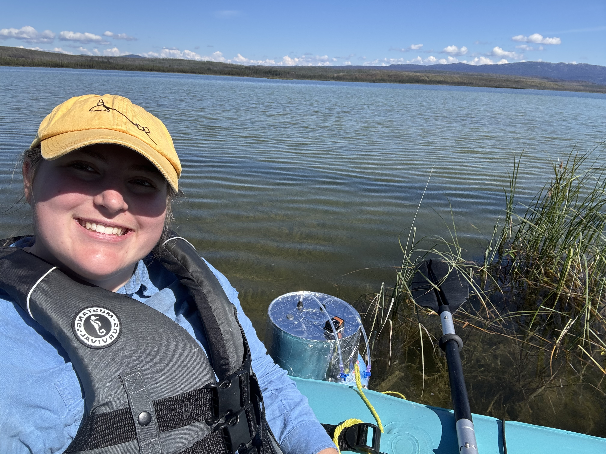{width="95%"}
:::

:::: {.column width="50%"}
::: {style="text-align: right;"}
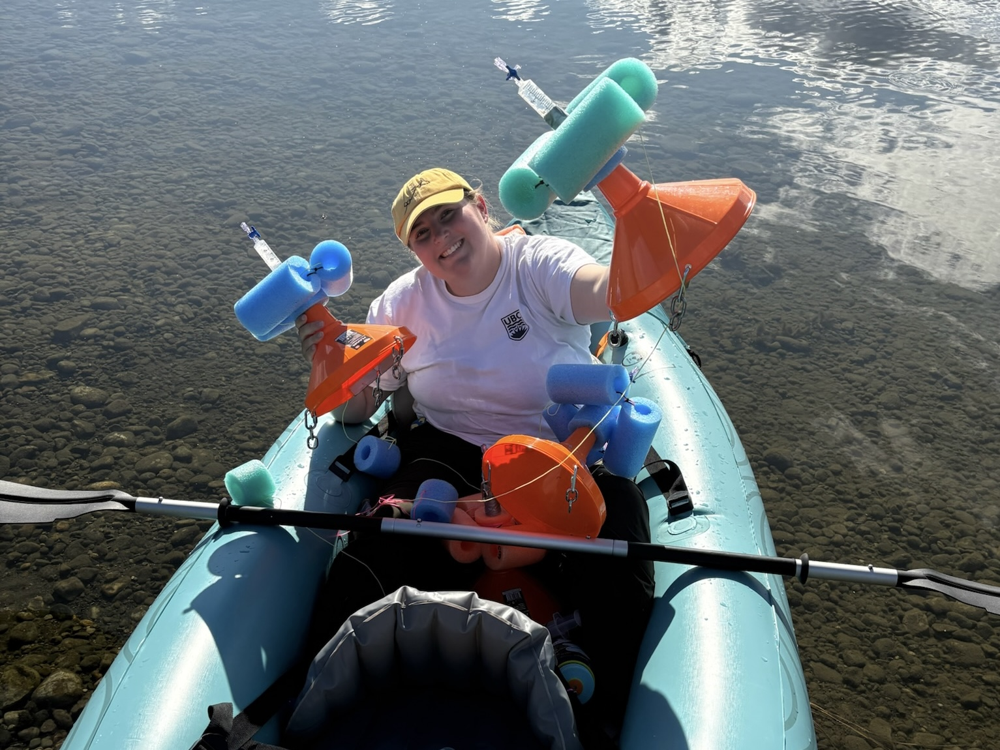{width="95%"}
:::
::::
::::::

Technically I was able to gain experience across different measurement techniques, from navigating fickle water quality sondes, reeling in floating chambers, and nailing down the one handed bubble trap sample! This gave me greater insight into how static, ground measurements are performed and the pros and cons associated with this type of sampling versus my previous work with eddy covariance towers. 

As well, this project allowed me a lot of time to reflect when each flux measurements took about 45 minutes, and in this time I was able to slow down and appreciate the surroundings and what science has allowed me to do. Sitting along the shoreline watching loons, mallards, and dragonflys pass us by was a nice reminder about why I wanted to get into this research. While this work is important to understand human's impact on the world, it also comes down to protecting these ecosystems and the species that rely on it, we not only have a responsibility towards protecting our future generations, but also the generations of loons, moose, and beavers that call these systems their home. 

:::::: columns
::: {.column width="33%"}
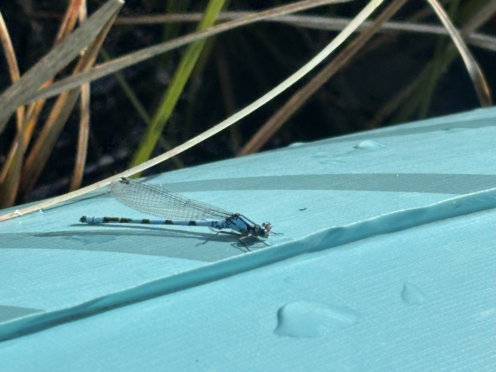{width="95%"}
:::

:::: {.column width="33%"}
::: {style="text-align: center;"}
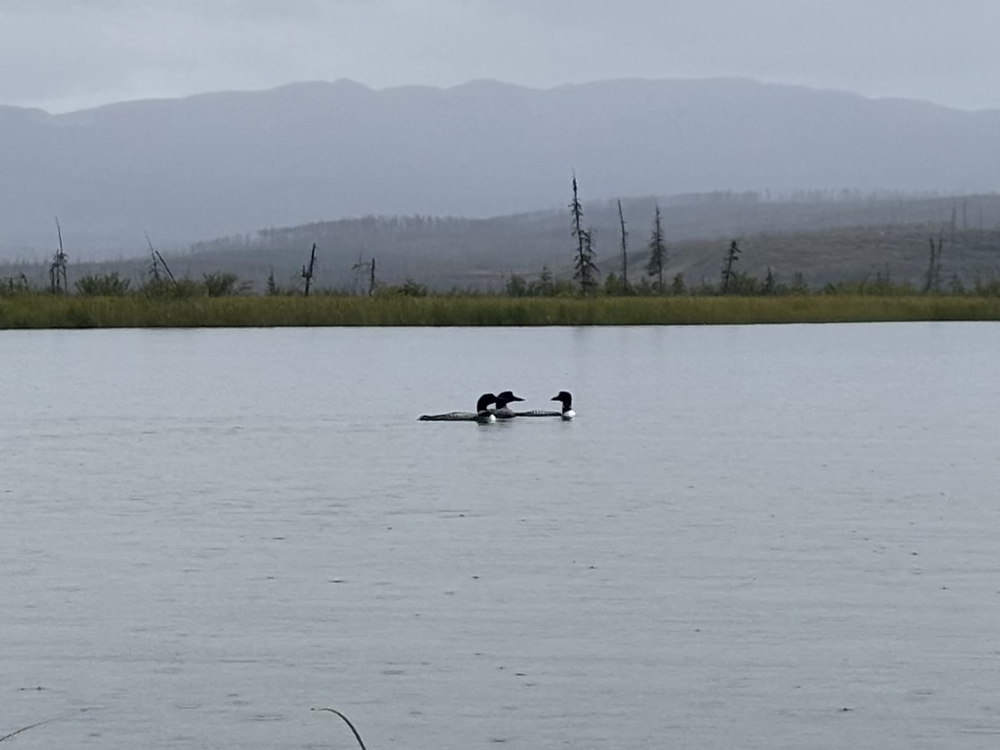{width="95%"}
:::
::::

:::: {.column width="33%"}
::: {style="text-align: right;"}
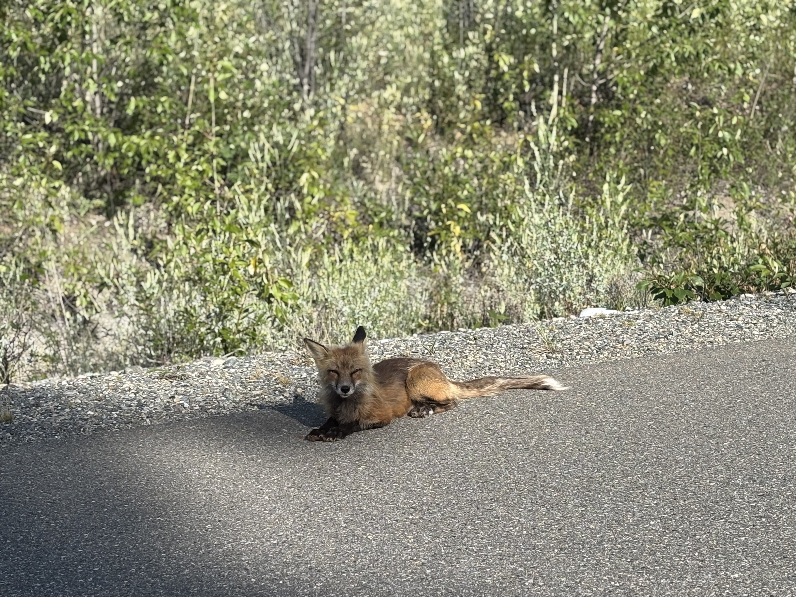{width="95%"}
:::
::::
::::::

Personally, a lot of growth occurred during my masters where I was able to understand who I want to be as a researcher and the legacies I leave behind. I loved being able to connect, and in some cases, mentor other members within the lab and that experience is fueling me in my current job search. Research can sometimes be daunting and intimidating to those outside it, but I look forward to fostering more connections and hopefully imparting some - potentially unsolicited - advice to those entering field and research positions!

::::: {.columns .align-items-left style="gap: 2.5rem;"}
::: {.column width="50%"}

:::

::: {.column width="50%"}
Here is a video I made as a product for my Weston Family and WCS Canada Boreal Research Fellowship talking about the uses of Floating Chambers and Bubble Traps to capture CH4 in the field. Take a listen if you'd like to (A) learn a little more about aquatic Carbon measurements and (B) want a view into the field!
:::
:::::

## NSERC Undergraduate Student Research Lead (Cambodia)

::::: {.columns .align-items-left style="gap: 2.5rem;"}
::: {.column width="50%"}
I was fortunate enough to have received an NSERC Undergraduate Student Research Award that let me pursue a research project with [Dr. Naomi Schwartz](naomibschwartz.github.io) in Cambodia. My project sought to understand how belowground carbon dynamics, through soil bulk density and fine root inventories, change across savanna-forest boundaries. This project entailed working across three study sites, with varying landscapes and we used transects to evaluate spatial variation horizontally and soil coring to get vertical profiles. This work would not have been possible without the wonderful field workers that supported us, Bou Phem, Bou Sy, Bou Reng, and Bou Chin - learning Khmer inside jokes and making them laugh as I tripped over forest brush was a highlight!
:::

::: {.column width="50%"}
   
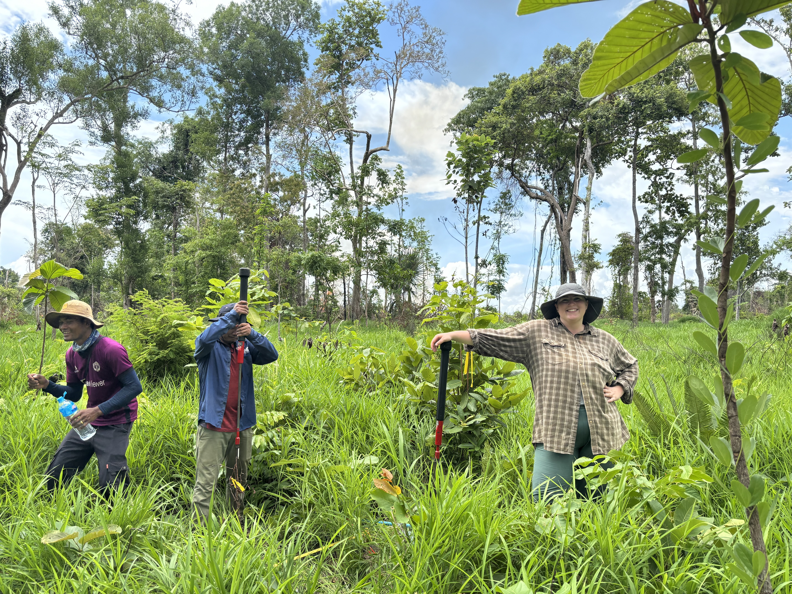{width="95%"}
:::
:::::

This was my introduction in leading a research project, with lots of support from Dr. Schwartz and the extraordinary Mia Fajeau who was conducting research on what sustains stable boundaries between savannas and forests in this system - check out their incredible thesis [here](https://open.library.ubc.ca/soa/cIRcle/collections/ubctheses/24/items/1.0451919?o=0)!! Spending 6 weeks travelling across Cambodia, getting an arm workout with the soil corer, and working on my eyesight sorting through fine roots and charcoal was incredible for me as a scientist, but the reason why this work was so rewarding was because of those who were around for it. This experience highlighted for me the joy of doing research with a team of individuals who are caring, kind, and interested and knowledgable about the work. While there were tough days, everyone who was apart of this work made it easy to forget about the amount of sweat my body was producing and the many ant bites. After this work I knew I wanted to continue research and I am so grateful for the people who were there to make this a memorable and life-shaping experience!

:::::: columns
::: {.column width="33%"}
 
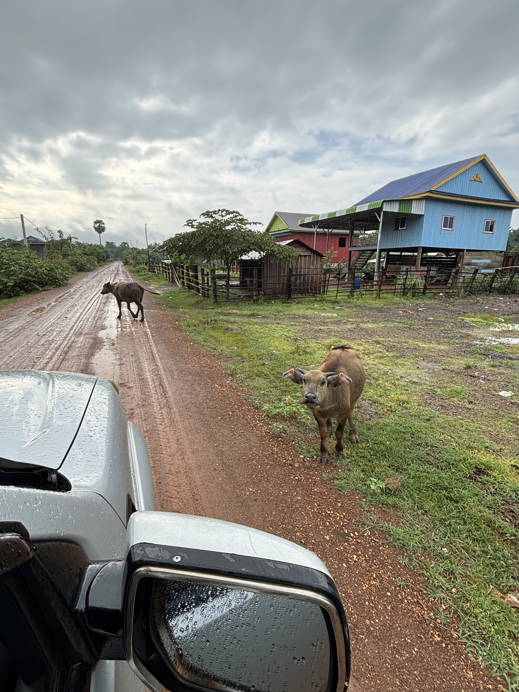{width="95%"}
:::

:::: {.column width="33%"}
::: {style="text-align: center;"}
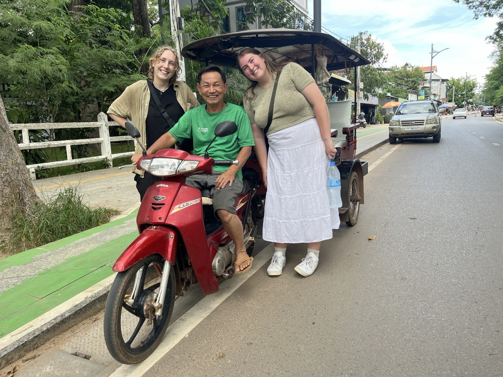{width="95%"}
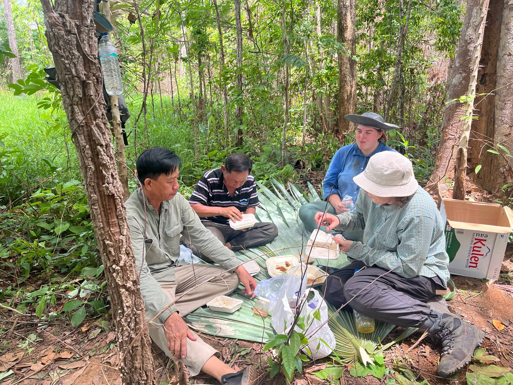{width="95%"}
:::
::::

:::: {.column width="33%"}
::: {style="text-align: right;"}
 
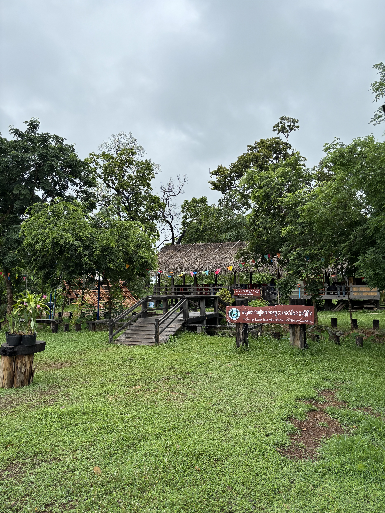{width="95%"}
:::
::::
::::::

## Undergraduate Research Assistant (hən̓q̓əmin̓əm̓, Sḵwx̱wú7mesh sníchim - BC)

::::: {.columns .align-items-left style="gap: 2.5rem;"}
::: {.column width="40%"}
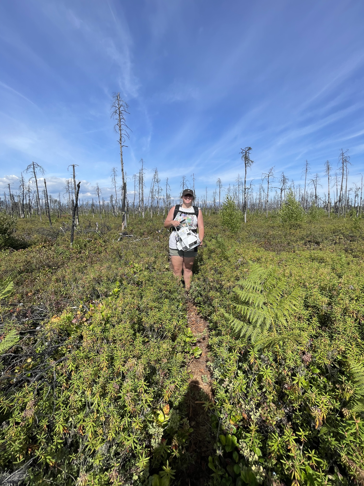{width="95%"}
:::

::: {.column width="60%"}
This is where it all started! In the summer after my 3rd year of undergrad I was able to work as a research assistant with the [UBC Micrometeorology Lab](https://ecoflux-lab.github.io/) led by Dr. Sara Knox. I worked with Zoe (Hehan) Zhang on her research studying how post-fire seedling growth alters Carbon dynamics within a peatland bog. As the support on this project I helped to collect Carbon flux data using the LICOR Smart Chamber, and basic environmental data like soil moisture and temperature. 

 
Alongside being a field assistant I also helped to create educational materials on eddy covariance towers for distribution in communities around the study sites, I created code to help process Phenocam imagery, and I also helped to translate over a ShinyApp for lab use to display Eddy Covariance Data.
:::
:::::